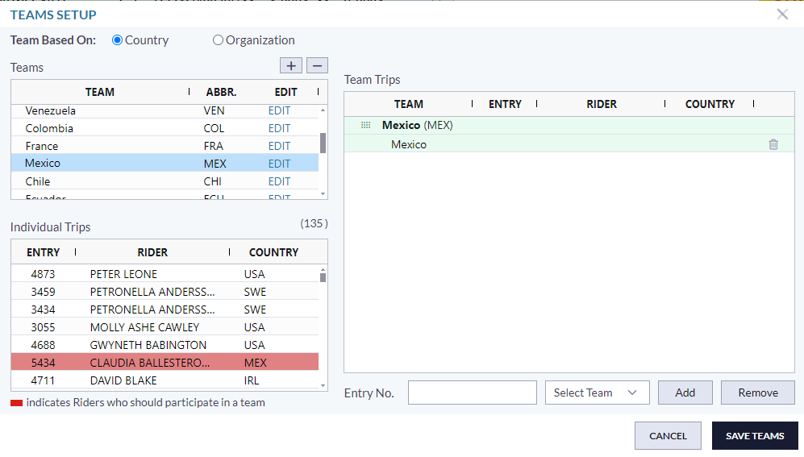
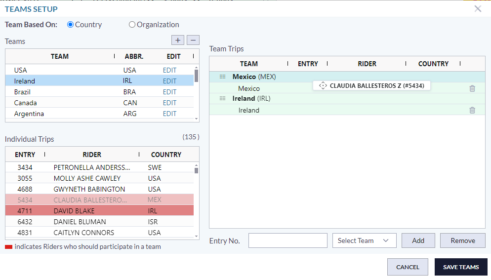
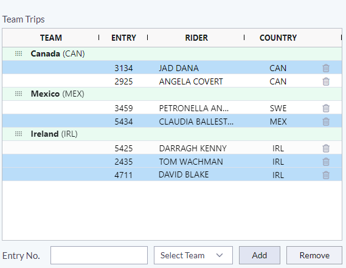

# 4D Setup Teams Dialog with AG Grid

This repository contains a React-based implementation of the 4D Setup Teams dialog using AG Grid technology. It includes advanced AG Grid concepts and custom functionalities such as drag and drop, sorting of group nodes, and more.

## Documentation

For detailed documentation, visit the [4D Documentation](http://docs.showgroundsonline.com/documentation/team-scoring-draft/#9663).

## Features

### 1. Adding Teams to Class

#### 1.1. Selecting Teams
- **Double-Click**: Users can select any team by double-clicking on the row of the team grid.
- **Drag/Drop**: Teams can also be selected using drag and drop functionality.

#### 1.2. Highlighting Trips
- **Highlighting**: Upon selecting teams, individual trips associated with the selected teams’ country will be highlighted in red color.

*Note: Only the teams with trips are linked with a class.*

### 2. Assigning Trips to Teams

Trips can be assigned to teams in three ways:

#### 2.1. Manual Entry
- **Input Field**: Type the entry number in the input field, select the team from the dropdown, and hit the add button.

#### 2.2. Add Multiple Entries – Quick Selection
- **Double-Click**: Double-click on individual trip rows to generate a comma-separated list in the input field. Users can then select a team and hit add.

#### 2.3. Drag/Drop
- **Drag/Drop**: Assign trips to teams by dragging and dropping between grids.

### 3. Deleting Trips of Team

#### 3.1. Single Trip Deletion
- **Delete Icon**: Delete a single trip by clicking on the delete icon.

#### 3.2. Multiple Trip Deletion
- **Highlight and Remove**: Highlight multiple rows and hit the Remove button to delete multiple trips.

#### 3.3. Multiple Trip Deletion Among Teams
- **Multi-Delete**: This feature is also enabled among teams.

### 4. Changing Teams Order within Class

#### 4.1. Drag/Drop
- **Reorder**: Change the order of teams within the class by dragging and dropping the team’s name node with the dragged icon.

#### 4.2. Alphabetic Sorting
- **Sort**: Perform alpha sorting from the Team column header.

### 5. Adding New Teams

#### 5.1. Based on Country
- **Add Teams**: Users can add teams based on country.

#### 5.2. Based on Organization
- **Add Teams**: Teams can also be added based on organization.

